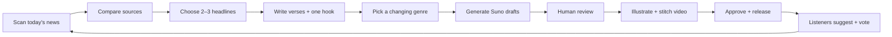

  
  <h1>Daily Chorus</h1>
  
<strong>Turning bad news into bangers.</strong>

  
The day's headlines. A different sound. One chorus that brings it together.

  

    <a href="https://www.youtube.com/@DailyChorusSong">Watch on YouTube</a> ·
    <a href="https://x.com/DailyChorusSong">Follow & vote on X</a> ·
    <a href="docs/workflow.md">Explore the loop</a>
  

---

The news changes every day. So should its soundtrack.

**Daily Chorus** turns two or three current headlines into an original song: a small daily medley with a big hook. Good news, bad news, scary news, funny news; stories from around the world and closer to home. Original lyrics, AI-assisted music, and illustrated scenes connect the reporting to the feeling of the day.

A scientific breakthrough might become bright pop. A strange local headline might become a rap verse. A tense world story might find its way into a driving electronic chorus. Those are creative possibilities, not claims about real events.

## The loop

Each headline gets a verse or a short section. The chorus captures the shared mood. A release comes with **Behind the song** notes so listeners can trace the stories, sources, and creative choices.

## A wider news diet

| Dimension | What we look for |
| --- | --- |
| Mood | Good, bad, scary, funny—and the complicated stuff between them |
| Reach | World news and national news; the initial national lens is the U.S. |
| Evidence | Independent reporting, primary evidence where available, and clearly identified uncertainty |

Mood and geography are separate tags: a world story can also be funny or hopeful. We seek variety across the week and choose each day's medley from the reporting actually available.

## A changing sound

**Rap · techno · pop · K-pop inspired pop · pop-punk · rock · metal**

There is room for house, drum and bass, hyperpop, Afrobeats, Latin pop, soul, and acoustic sounds too. A verified listener poll takes priority; otherwise the next song explores a different genre from the previous day's. Current musical trends can influence the choice when supported by a recent source.

The sound is original. Prompts describe rhythm, instruments, energy, and vocal delivery. English is the starting language, including for K-pop inspired arrangements.

## Reporting you can inspect

Inspired by [Ground News's approach to comparing coverage](https://ground.news/rating-system), our editorial process records what sources agree on, what they dispute, and what each emphasizes or leaves out.

- Verify every included headline with at least two independent newsrooms. Reprints of the same wire report count as one.
- Separate confirmed facts, attributed claims, and interpretation.
- Cite any available outlet bias or factuality rating, including its provider and date. Outlet ratings are context, not a truth score for an individual article.
- Use neutral factual summaries and weight claims by evidence. Avoid manufacturing balance between a supported fact and an unsupported claim.
- Explain the editorial selection. “The biggest story” is a judgment, not a universal ranking.

Daily Chorus is an independent project. Ground News is an inspiration, not an affiliation or an integrated data service.

## The visual treatment

Think **illustrated news mixtape**: one scene per headline, a shared navy-and-amber identity, readable lyric captions, and cuts that follow the chorus.

Funny stories can get surreal, playful illustrations. Tense stories can use atmospheric imagery. Serious human stories get a respectful treatment. Generated pictures are clearly creative illustrations; reporting and source links accompany the release.

The video plan supports a full YouTube song plus a 20–30 second vertical chorus cut for Shorts and X. Original AI artwork is the default; article illustrations require confirmed reuse rights and the appropriate credits. See the [visual playbook](docs/visuals.md).

## What is live

- **YouTube:** [@DailyChorusSong](https://www.youtube.com/@DailyChorusSong)
- **X:** [@DailyChorusSong](https://x.com/DailyChorusSong)
- A daily draft-generation workflow using the existing Suno Pro account, with review before release.

This repository contains the pilot's editorial workflow, brand asset, and packet template. The current scheduler runs in Codex on the creator's computer; a standalone runner and video renderer are future implementation work. Draft generation still depends on an available signed-in browser and can require human verification.

## Take part

Suggest a headline, tell us which sound fits tomorrow, or join an approved genre poll on X. The planned voting loop rotates four options from the wider genre pool. With no votes, we choose a fitting new sound and say why.

To improve the project, [open an issue](https://github.com/CosmonautJones/daily-chorus/issues) with a source link, an editorial improvement, or a visual idea.

## Make a release

1. Follow the [workflow](docs/workflow.md) and prepare a [review packet](docs/packet-template.md).
2. Generate one normal Suno request for the date and retain its returned versions.
3. Select a version, check the audio download entitlement, and build its illustrated video.
4. Review the actual song, video, source notes, caption, and destination before publication.

The pilot uses an existing Suno Pro subscription and free tools. Purchases, distribution agreements, and additional paid services require a separate decision.

  
<strong>A little context. A little chaos. A chorus worth coming back for.</strong>

